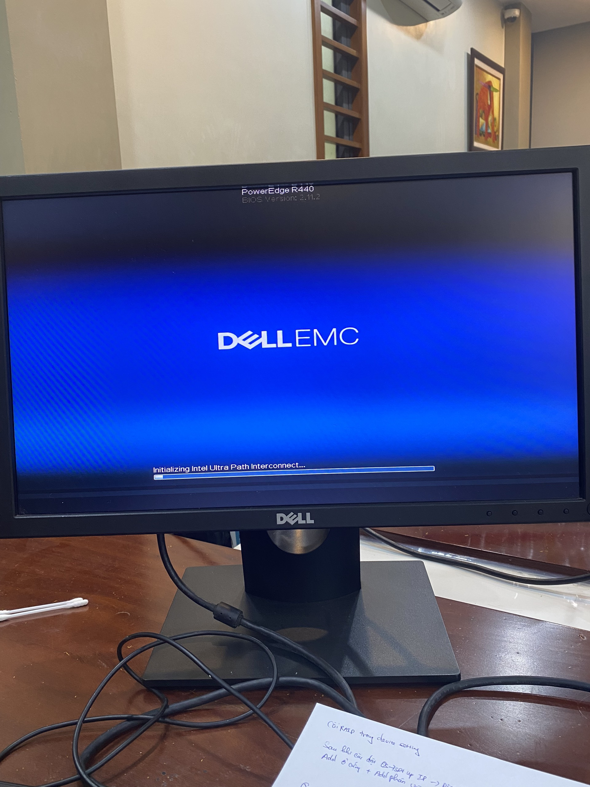
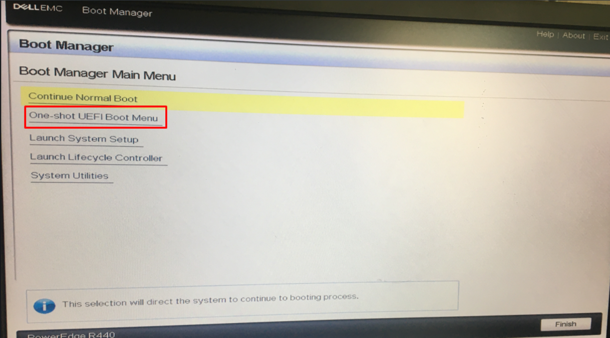
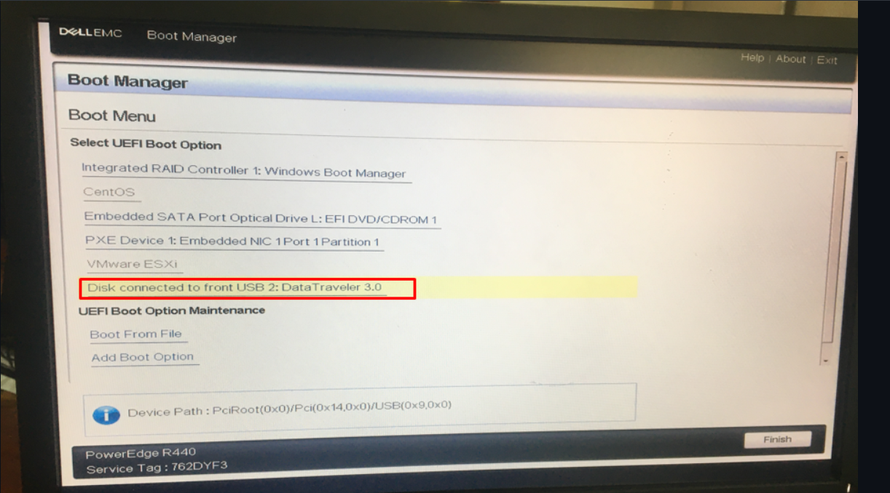
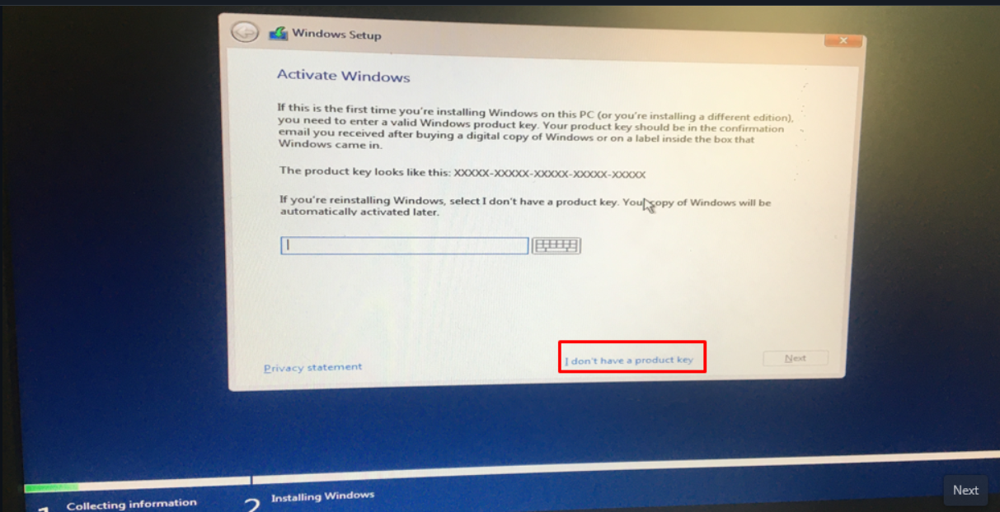
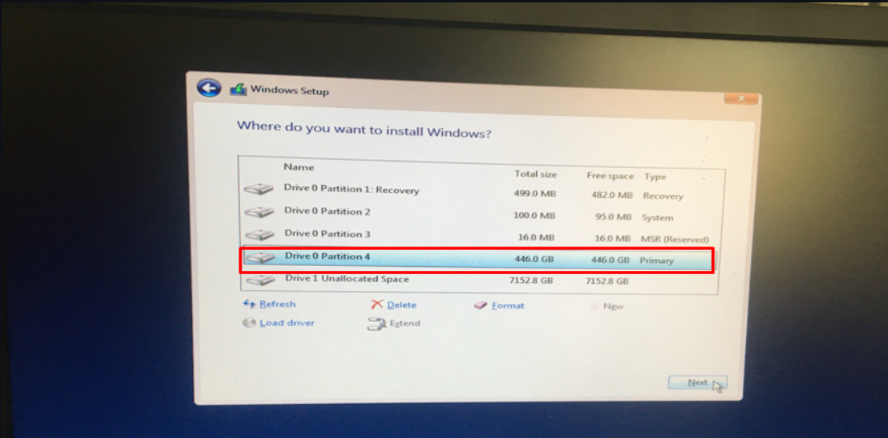
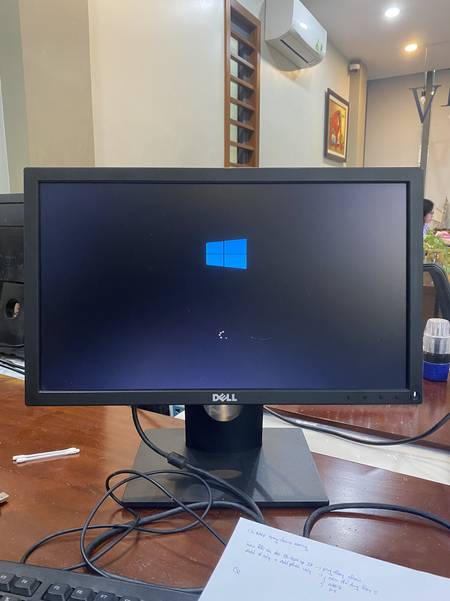
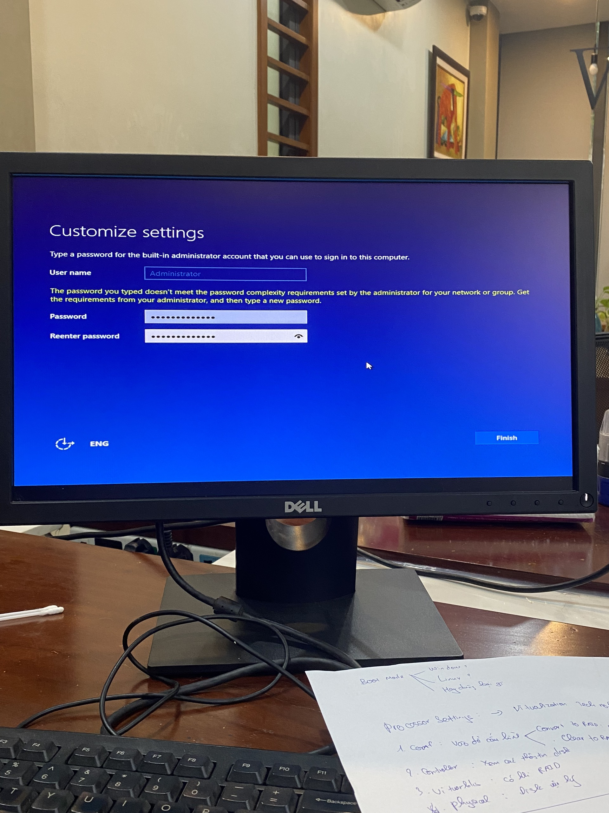
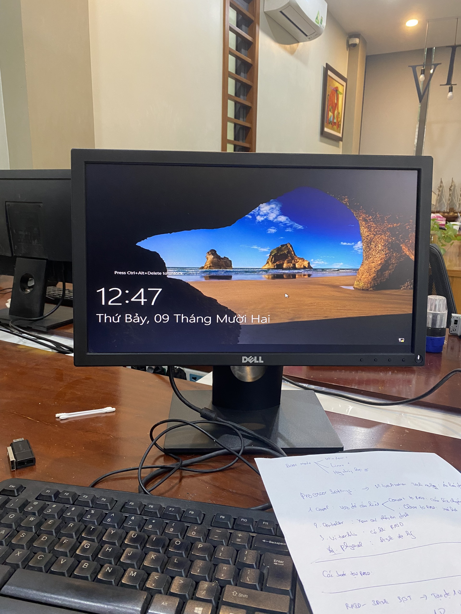

# Tổng quan về Server vật lý
MỤC LỤC
- [Tổng quan về Server vật lý](#tổng-quan-về-server-vật-lý)
  - [1. CPU](#1-cpu)
  - [2. RAM](#2-ram)
  - [3. Ổ cứng](#3-ổ-cứng)
  - [4. Raid](#4-raid)
  - [5. Card Mạng](#5-card-mạng)
  - [6. Nguồn](#6-nguồn)
  - [7. Một số lưu ý khi lắp server](#7-một-số-lưu-ý-khi-lắp-server)
  - [8. Tiến hành lắp đặt Server Vật Lý:](#8-tiến-hành-lắp-đặt-server-vật-lý)
  - [9. Tiến hành cài win trên server Vật Lý](#9-tiến-hành-cài-win-trên-server-vật-lý)
  - [10. Tiến hành cài RAID cho Server](#10-tiến-hành-cài-raid-cho-server)
  - [11. Tiến hành cài và sử dụng iDRAC9 trên Server](#11-tiến-hành-cài-và-sử-dụng-idrac9-trên-server)
    - [11.1 Tiến hành Setup iDRAC9](#111-tiến-hành-setup-idrac9)
    - [11.2 Tiến hành sử dụng iDRAC](#112-tiến-hành-sử-dụng-idrac)

## 1. CPU
- 
- Nên chọn những CPU có nhiều nhân cho máy chủ
- Càng nhiều nhân CPU thì quá trình xử lý càng nhanh
- Một CPU có xung nhịp cao sẽ không bằng một CPU có nhiều nhân
- Các loại CPU Server phổ biến hiện nay: 
  - Intel Xeon: Phù hợp cho các máy chủ doanh nghiệp
  - AMD EPYC: Được đánh giá cao về hiệu suất
  - Intel Core: Phù hợp cho các máy chủ cá nhân, có khả năng xử lý đa nhiệm tốt
## 2. RAM
- 
- RAM server là một loại bộ nhớ đặc biệt được thiết kế để sử dụng trong các máy chủ và hệ thống công nghiệp với yêu cầu cao về tốc độ xử lý dữ liệu và khả năng chịu tải
- Hoạt động theo nguyên tắc tương tự như RAM máy tính thông thường
- Một số loại RAM Server:
  - RAM Unbuffered
  - RAM Registered
- Quan trọng đối với máy chủ vì nó ảnh hưởng đến vận hành và hiệu suất làm việc của hệ thống
## 3. Ổ cứng
- 
- Giúp và quyết định tốc độ đọc dữ liệu của bạn
- Có hai loại ổ cứng cho server:
  -  HDD (Hard Disk Drive): các ổ cứng có chuẩn giao tiếp SCSI hoặc SAS nên được lựa chọn
  -  SSD (Solid-State Drive): ưu tiên lựa chọn những loại có hiệu năng tốt
## 4. Raid
- 
- Là một hệ thống ổ đĩa cứng được ghép từ nhiều đĩa vật lý lại với nhau
- Nếu có 1 ổ cứng thì chỉ có thể cấu hình Raid 0
- Nếu có trên 2 ổ thì phải cấu hình Raid 1 vì Raid 0 không có dự phòng
- Nó giúp đảm bảo an toàn cho dữ liệu nhớ khả năng sao lưu, chống lỗi
- Hiện đại nhất là Raid 10. Tuy nhiên Raid càng cao càng tốn tiền
## 5. Card Mạng
- 
- Card mạng Server là một thiết bị phần cứng được cài đặt trên máy tính để nó có thể được kết nối với internet
- Dù cho cấu hình server của bạn có cao đến mức nào cũng bị phụ thuộc vào hệ thống mạng
- Các server vật lý luôn cần có băng thông cao cho kết nối internet để tránh trường hợp tắc nghẽn

## 6. Nguồn 
- 
- Nguồn Server hay còn được biết đến với cái tên Power Supply Unit (PSU) là thiết bị chuyên dụng cung cấp năng lượng cho các thiết bị khác bên trong, giữ vài trò quan trọng trong quá trình hoạt động của Server
- Có đa dạng các loại nguồn Server, nên chọn các nguồn phù hợp với máy chủ của bạn
- Thường 1 server sẽ chạy cùng lúc 2 nguồn

## 7. Một số lưu ý khi lắp server
- Đọc kĩ hướng dẫn trước khi Lắp
- Nên chọn và lắp các ổ cứng phù hợp, phụ thuộc vào độ to, bé của ổ cứng(2,5/3,5 inch)
- Lắp RAM theo hướng dẫn của nhà sản xuất, lắp các thanh ưu tiên hoặc lắp cho 1/2 CPU, nếu lắp sai có thể xảy ra trường hợp các thanh RAM hoạt động không hết công suất hoặc không hoạt động
- Lắp CPU chú ý chiều để lắp
- Lắp sử dụng lực vừa đủ, cẩn thận, không cần quá nhanh 

## 8. Tiến hành lắp đặt Server Vật Lý:
- 
- Lắp các thanh RAM theo thứ tự ưu tiên 
  - Các ô màu trắng lắp trước
  - Lắp dần theo số thứ tự
  - Lắp các ô màu đen theo số thứ tự
- Lắp ổ cứng 
- Tháo card mạng và thực hiện lắp
  - Chú ý các khớp để tháo
- Thực hiện đấu nguồn và khởi động server
- Kết nối dây màn hình, dây bàn phím
- Tiến hành sử dụng thử

## 9. Tiến hành cài win trên server Vật Lý
Hôm nay, tôi thực hiện cài thử Window 10 trên Server vật lý, sử dụng USB
Ban đầu, màn hình Server hiển thị đang được bật như sau:
- 

Chờ khi màn hình hiển thị các nút để vào BIOS, tiến hành bấm `F11` để truy cập vào Boot Manager
- Tiến hành chọn `One-shot UEFI Boot Menu` khi Server đã có sẵn 1 hệ điều hành và ta muốn cài 1 hệ điều hành mới
- 
- Tiến hành chọn USB có lưu trữ hệ điều hành cần cài:
- 
- Sau đó, tiến hành cài Window như trên máy tính cá nhân.
Một số lưu ý khi cài:
- Chọn mục này nếu như bạn không có Key Windows bản quyền:
- 
- Khi chọn phiên bản, nên chọn phiên bản Desktop để có đồ họa. Phiên bản Server sẽ chỉ có các câu lệnh
- 
- Thực hiện phân vùng ổ cứng, nếu như không có dữ liệu quan trọng ở hệ điều hành cũ, thực hiện xóa hết các ổ cứng và phân vùng lại. Sau đó, chọn ổ để cài hệ điều hành:
- 
-Sau đó, quá trình cài đặt dường như đã hoàn tất, màn hình sẽ hiện thị Windows:
- 
Tiến hành cài User cho Server:
- 
Sau khi bấm `Finish`, quá trình cài đặt đã hoàn tất. Ta tiến đến màn hình đăng nhập:
- 

Sau khi đăng nhập xong, giao diện của Window Server sẽ hiển thị như sau:
- 
- Tiến hành kiểm tra dung lượng ổ cứng:
- 
- Tiến hành cài IP tĩnh cho server:
- 
- Tiến hành test Ping thử sang một máy khác cùng kết nối cổng Ethernet:
- 

## 10. Tiến hành cài RAID cho Server
- Trước tiên, ta cần biết RAID là từ viết tắt của cụm Redundant Arrays of Independent Disks. Đây là một phương pháp kết hợp nhiều ổ đĩa cứng vật lý thành một hệ thống ổ đĩa cứng với chức năng gia tăng khả năng truy xuất dữ liệu và đọc/ghi từ đĩa cứng rất hiệu quả. RAID có nhiều loại khác nhau, mỗi loại có những tính năng riêng và hầu hết chúng đều được xây dựng nên từ 2 cấp độ cơ bản đó chính là RAID 0 cũng như RAID 1 
- Khi dùng RAID, dữ liệu sẽ được bảo vệ và hỗ trợ khả năng phục hồi dữ liệu nếu như bỗng nhiên có một ổ đĩa bị hỏng

- Khi màn hình Server khởi động như sau: 
- 
  - Chú ý thời gian để ấn nút vào BIOS
  - 
- Sau khi vào được BIOS, chọn **System Setup** --> **Device Settings**--> **Intergrated RAID Controller 1**
- 
- Tại **Main Menu**, chọn **Create Virtual Disk**
- 
- Tiến vào MENU tạo ổ đĩa ảo, thực hiện chọn như sau: 
- 
  - Chọn RAID 1 vì có >= 2 ổ đĩa. Với RAID 1, 1 ổ đĩa sẽ được dùng làm dự phòng đề phòng ổ đĩa chính hỏng. Nghĩa là bạn sẽ chỉ dùng được 50% dung lượng
  - Sau khi chọn xong RAID, thực hiện chọn ổ vật lý
- 
  - Nên chọn Both để hỗ trợ tối ưu nhất (cả SSD và HDD)
  - Chọn **Check All** để chọn tất cả ổ vật lý
  - Sau đó bấm **Apply Changes** để lưu
- Sau khi lưu xong, kéo tới cuối cùng và chọn **Create Virtual Disk**
- 
- Đồng ý và xác nhận việc tạo ổ đĩa ảo cho đến khi màn hình Success hiện ra nghĩa là bạn đã hoàn thành việc cài đặt RAID
- 

## 11. Tiến hành cài và sử dụng iDRAC9 trên Server
- Hiểu đơn giản, iDRAC9 là một trình quản lý Server từ xa, được tích hợp sẵn trong các máy chủ DELL EMC 
- Cho phép người quản lý máy chủ có thể theo dõi, kiểm soát và quản lý hệ thống từ xa thông qua giao diện web hoặc các dòng lệnh(tùy thuộc vào phiên bản iDRAC)
### 11.1 Tiến hành Setup iDRAC9 
- Ta tiến hành vào **System Setup** như bình thường
- Nhưng ở đây, ta sẽ trỏ vào mục **iDRAC Setting**
- 
- Sau đó, **MENU iDRAC Setting** sẽ được hiện ra
- 
- Ta chỉ cần quan tâm đến 2 thư mục trong phần này:
  - Cài đặt Mạng
  - Cài đặt User
- Tiến hành cài đặt Mạng:
  - Trỏ vào mục **Network**
  - Ở trong mục này, ta cần chú ý đến mục thiết lập IPv4
  - Tắt **DHCP**
  - 
  - Thực hiện set up các thông tin cho IPv4
    - Chú ý nhớ dải mạng mà bạn đã set up cho iDRAC để sau này có thể vào truy cập iDRAC9
    - Tắt IPv6 nếu bạn thấy nó không cần thiết
- Tiến hành cài User:
  - Tìm kiếm mục **User Configruation**
  - Tiến hành cài User và Password cho User iDRAC
  - 
- Sau các bước trên, bạn đã hoàn thành cài đặt iDRAC

### 11.2 Tiến hành sử dụng iDRAC
- Trước tiên, để có thể sử dụng được, 
  - Bạn sẽ cần 1 dây cap mạng để kết nối giữa máy tính cá nhân và Server
  - Thiết lập mạng Ethernet trong máy tính cá nhân sao cho cùng dải mạng với iDRAC trên Server
- Truy cập vào trình duyệt và tìm đến địa chỉ IP của iDRAC trên Server mà bạn đã cài đặt
- Sau khi tiến hành đăng nhập với User iDRAC mà bạn đã tạo, màn hình hiển thị iDRAC9 sẽ hiện ra như sau:
- 
- iDRAC9 sẽ như một công cụ giúp bạn điều khiển Server từ xa
  - Xem các thông tin về Server
  - Điều khiển tắt, bật, reboot máy chủ từ xa:
  - 
  - Xem thông tin, tình trạng máy chủ:
  - 
- Ngoài ra, bạn còn có thể xem trực tiếp màn hình máy chủ thông qua iDRAC
- Thực hiện cài OS cho máy chủ thông qua iDRAC9 ở máy client