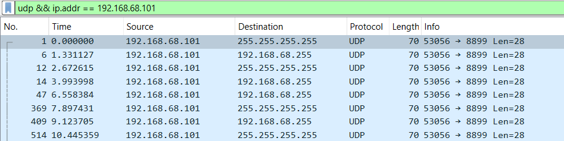
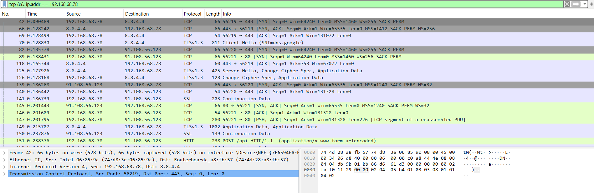
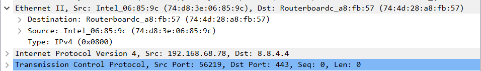
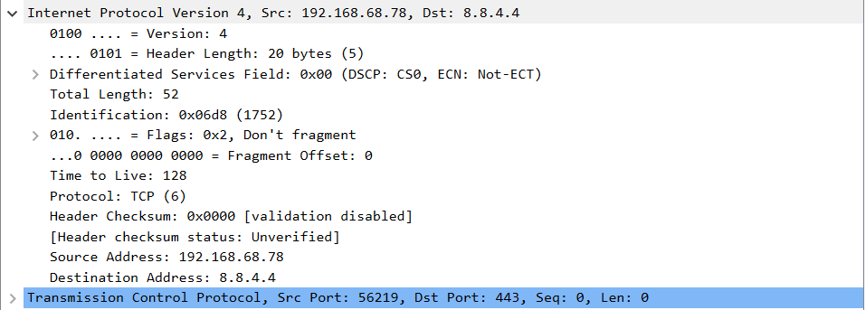
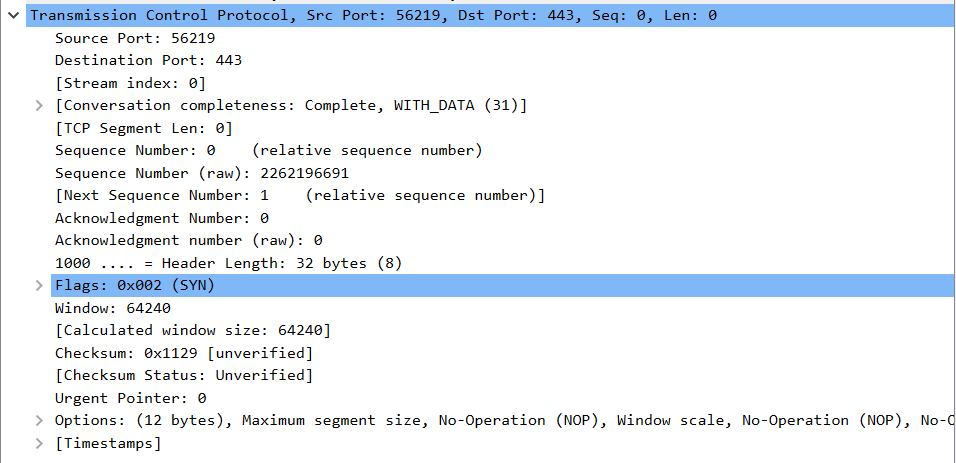
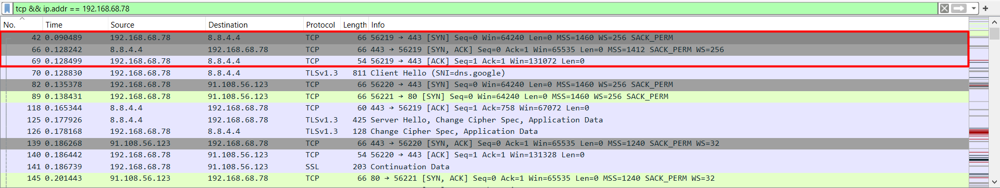
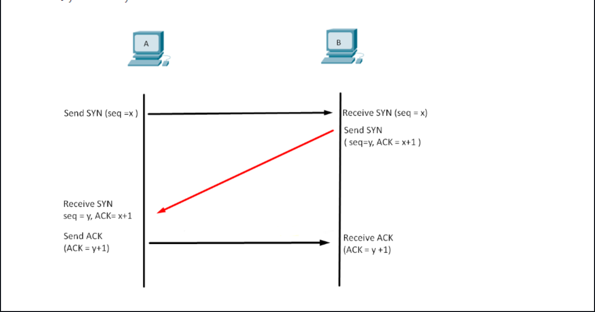

# Ứng dụng WireShark

## 1. WireShark là gì?

- Là 1 ứng dụng phân tích mạng
- Có thể bắt, phân tích, xác định các vấn đề có liên quan đến internet:
    + kết nối chậm
    + rớt gói tin
    + truy cập bất thường

==> Thông qua WireShark, quản trị viên có thể 
- hiểu hơn về Network Packets đang chạy trên hệ thống
- xác định lỗi và nguyên nhân gây ra lỗi một cách dễ dàng hơn

## 2. WireShark dùng để làm gì
- Để khắc phục sự cố mạng
- Kiểm tra các vấn đề liên quan đến bảo mật
- Xác minh các ứng dụng mạng
- Gỡ lỗi khi triển khai giao thức
- ...
## 3. Một vài tính năng nổi bật
- Có sẵn cho các hệ diều hành
- Có thể chụp dữ liệu gói trực tiếp từ giao diện mạng
- Thực hiện mở các tệp chứa gói dữ liệu bằng tcpdump, Windump
- Nhập các gói từ các tệp văn bản có chứa các hex dump của packetdata
- Hiển thị các gói thông tin 1 cách vô cùng chi tiết
- Tiến hành lưu trữ tất cả các dữ liệu gói đã bị bắt
- Xuất 1 số hoặc tất cả các gói thông qua định dạng capture file
- Dựa vào các tiêu chí khác nhau để chọn lọc gói tin
- Dựa trên nhiều tiêu chí để tìm kiếm các gói
- Colorize là gói hiển thị dựa trên bộ lọc
- Tạo các số liệu thống kê khác nhau

## 4. Cách mà WireShark hoạt động
Sử dụng pcap để nắm bắt các gói tin từ một mạng hoặc 1 tệp. Sau đó, nó thực hiện phân tích cú pháp và giải mã. Nó sẽ hiển thị cấu trúc và ý nghĩa của các giao thức mạng khác nhau. 

## 5. Cách tải và cài đặt WireShark 
- Truy cập vào trang web của [WireShark](https://www.wireshark.org/)
- Thực hiện chọn phiên bản phù hợp với máy tính của bạn.Wireshark cung cấp ba phiên bản khác nhau:
    + Phiên bản dành cho máy tính để bàn được sử dụng cho các sự cố mạng thực tế
    + Phiên bản di động được sử dụng để phân tích pháp y
    + Phiên bản trực tuyến được sử dụng để phân tích pháp y và cung cấp đầy đủ chức năng của giao thức phân tích mạng

- Sau khi lựa chọn phiên bản và thực hiện dowload, bạn sẽ được 1 file `.exe`như thế này. Lúc này hãy thực hiện cài đặt = cách bấm `Open file` 

- Thực hiện làm theo các bước:Bấm `Next` để bắt đầu cài đặt

- Đọc các nội quy và thực hiện bấm `Next` để tiếp tục

-  

- 

- Thực hiện chọn các gói mà bạn muốn cài đặt. Ở đây tôi chọn tất cả gói để có thể sử dụng được hết các tính năng của WireShark
- 

- Chọn để tạo các Shortcuts
- 
- Chọn thư mục, đường dẫn chứa file
- 
- Cài đặt **Ncpap**
- 
- Cài đặt **USBPcap** (nếu muốn)
- 
- Chờ tiến trình cài đặt xong và bấm `Next`để tiếp tục
- 
- Tiến hành cài **Ncpap**, bấm chọn `I Agree`
- 
- Lựa chọn các options và bấm `Install` để tiến hành cài đặt
- 

- Chờ tiến trình cài đặt hoàn tất và bấm `Next`
- 
- Sau đó: 
- 

- Vậy là bạn đã cài đặt thành công **WireShark** vào máy tính cá nhân^^

## 6. Các thao tác cơ bản với WireShark

- Màn hình khởi đầu: 
- 
- Trong đó có:
- 
 
 - Các thanh công cụ:
- 

    - Ta bắt đầu với thanh **MENU** màu đỏ:
        - `File`: Cho phép bạn mở, lưu, xuất và in các tệp chụp gói tin
        - `Edit`: Cung cấp các tùy chọn để tìm kiếm, đánh dấu và chỉnh sửa các gói tin
        - `View`: Cho phép bạn tùy chỉnh giao diện người dùng, bao gồm cả cách hiển thị các gói tin
        - `Go`: Cung cấp các tùy chọn để điều hướng qua các gói tin
        - `Capture`: Cho phép bạn bắt đầu và dừng việc chụp gói tin
        - `Analyze`: Cung cấp các công cụ để phân tích các gói tin
        - `Statistics`: Hiển thị các số liệu thống kê về các gói tin đã chụp
        - `Telephony`: Cung cấp các công cụ để phân tích các gói tin liên quan đến điện thoại
        - `Wireless`: Cung cấp các công cụ để phân tích các gói tin không dây
        - `Help`: Cung cấp trợ giúp và thông tin về Wireshark

    - Tiếp đến là thanh **Tools** màu xanh:
        - `Start Capture`: Bắt đầu bắt gói tin với các tùy chọn giống như lần bắt cuối cùng hoặc các tùy chọn mặc định nếu không có tùy chọn nào được đặt
        - `Stop Capture`: Dừng việc bắt gói tin hiện đang chạy
        - `Restart Capture`: Khởi động lại phiên bắt hiện tại
        - `Options…`: Mở hộp thoại “Capture Options”
        - `Open…`: Mở hộp thoại mở tệp, cho phép bạn tải một tệp bắt để xem
        - `Save As…`: Lưu tệp bắt hiện tại thành bất kỳ tệp nào bạn muốn
        - `Close`: Đóng tệp bắt hiện tại. Nếu bạn chưa lưu tệp bắt, bạn sẽ được yêu cầu lưu nó trước
        - `Reload`: Tải lại tệp bắt hiện tại
        - `Find Packet…`: Tìm một gói tin dựa trên các tiêu chí khác nhau
        - `Go Back`: Nhảy về phía sau trong lịch sử gói tin
        - `Go Forward`: Nhảy về phía trước trong lịch sử gói tin
        - `Go to Packet…`: Đi đến một gói tin cụ thể
        - `Go To First Packet`: Nhảy đến gói tin đầu tiên của tệp bắt
        - `Go To Last Packet`: Nhảy đến gói tin cuối cùng của tệp bắt
        - `Auto Scroll in Live Capture`: Tự động cuộn danh sách gói tin trong khi thực hiện bắt trực tiếp
        - `Colorize`: Tô màu danh sách gói tin
        - `Zoom In`: Phóng to dữ liệu gói tin (tăng kích thước phông chữ)
        - `Zoom Out`: Thu nhỏ dữ liệu gói tin (giảm kích thước phông chữ)
        - `Normal Size`: Đặt mức phóng về 100%
        - `Resize Columns`: Thay đổi kích thước các cột, để nội dung phù hợp vào chúng

- Sau khi chọn mạng để bắt gói tin(ở đây tôi chọn mạng WIFI) màn hình làm việc của WireShark sẽ hiện ra
- 
    - Ô màu nâu là nơi bạn nhập các **Filter** - tức là các câu lệnh cho việc thực hiện chọn lọc tìm kiếm. Tôi biết một số câu lệnh cơ bản như sau: 
        + `ip.addr == ... `:  Hiển thị các gói tin chuyển từ ip này hoặc chuyển tới ip này
        + `tcp`: Hiển thị các gói tin sử dụng giao thức tcp. Tương tự nhập tên các giao thức khác như udp, http,arp, quic,.... để hiện thị ra các gói tin chỉ sử dụng những giao thức này
        + `tcp.port (== ...)`: Hiển thị các gói tin đi tới hoặc đi từ 1 port nào đó của giao thức tcp. Hoặc với bất kì port nào, chỉ việc thay `tcp` = tên port
        + Toán từ `&&` để tìm kiếm đồng thời 2 trường
        + Và còn rất nhiều câu lệnh khác mà bạn có thể tự khám phá chỉ cần nhập mẫu 1 thứ gì đó bạn muốn tìm kiếm, **WireShark** sẽ gợi ý cho bạn
    - Ô màu đỏ: Hiển thị danh sách các gói tin bắt được
    - Ô màu xanh lá: Hiển thị thông tin chi tiết của 1 gói tin
    - Ô màu xanh dương: Hiển thị thông tin khi đã được chuyển đổi sang hệ **Hex** sau đó thực hiện mã hóa
    - Ô cuối cùng hiển thị 1 vài thông tin về gói tin đã chọn

## 7. Coloring Rule mặc định của WireShark

|Màu|Giải thích|
|---|----------|
|Tím nhạt|Giao thức TCP|
|Xanh nhạt|Giao thức UDP|
|Đen|Các gói tin có lỗi|
|Xanh lá nhạt|Lưu lượng HTTP|
|Vàng nhạt|Dành riêng cho Windows, bao gồm khối tin nhắn máy chủ(SMB) và NetBIOS|
|Vàng đậm|Lộ trình|
|Xám đen|Cờ SYN, FIN, ACK,...|
|Đỏ|Các gói tin có vấn đề tiềm ẩn|
## 8. Thực hành bắt và phân tích gói tin của 1 vài giao thức:
### 8.1 UDP
- Tiến hành nhập `udp` vào ô chọn lọc để thực hiện tìm các gói tin sử dụng giao thức udp
- 

- Bảng thông tin hiện ra với các cột cụ thể như sau:
- 
    - No: Số thứ tự
    - Time: Thời điểm
    - Source: IP máy gửi
    - Destination: IP máy nhận
    - Protocol: Giao thức
    - Length: Chiều dài gói tin
    - Info: Thông tin về gói tin
- Bảng thông tin chi tiết:
- 
- Ở đây, có 3 trường mà chúng ta cần quan tâm:
    + Ethernet Header: 
    + 
        + Loại công nghệ mạng: Ethernet II
        + Destination: Địa chỉ MAC bên nhận là ff:ff:ff:ff:ff:ff
        + Source: Đỉa chỉ MAC bên gửi là 40:5b:d8:47:c2:67
        + Type: Loại IP: IPv4
    + IPv4 Header: 
    + 
        + 0100...: Sử dụng IP version 4
        + Header Length: Chiều dài header: 20 bytes
        + Flags: Cờ 
        + Time To Live: số lần đi qua nút mạng còn lại
        + Protocol: Giao thức sử dụng: UDP
        + Header Checksum: Check lỗi
        + Source Address: địa chỉ IP nguồn: 192.168.68.101
        + Destination Address: địa chỉ IP đích đến: 255.255.255.255
    + UDP header:
    + 
        + Source Port: Cổng Port từ máy gửi: 53056
        + Destination Port: Cổng Port máy nhận: 8899
        + Length: Chiều dài gói tin: 36
        + Checksum: Kiểm tra lỗi
        + UDP Payload: gói dữ liệu vận chuyển
    
- 
- Theo bảng trên ta có thể thấy, UDP không hề thiết lập một quá trình kết nối nào trước tiên mà thực hiện truyền dữ liệu ngay khi có.

### 8.2 TCP
- IP máy tính: `192.168.68.78`
- Tiến hành nhập fiter: `tcp && ip.addr == 192.168.68.78`, chọn dòng đầu tiên(no. 42), bảng thông tin các gói tin sử dụng giao thức TCP được gửi từ và gửi đến IP: 192.168.68.78 hiện ra:
- 
- Tiến hành phân tích gói tin TCP:
    + Ethernet Header: 
    + 
        + Sử dụng công nghệ mạng: Ethernet II
        + Source MAC: 74:d8:3e:06:85:9c
        + Destination MAC: 74:4d:28:a8:fb:57
        + Loại IP: IPv4
    + IPv4 Header:
    + 
        + Source IP: 192.168.68.78
        + Destination IP: 8.8.4.4
        + Time to live: 128
    + TCP Header:
    + 
        + Source Port: 56219
        + Destination Port: 443(HTTPS)
        + Sequence Number: 0 [Next Sequence Number = 1]
        + Acknowledgment number: 0
        + Flags: SYN
    
    ==> Đây là gói tin đầu tiên của giao thức TCP khi bắt đầu gửi 1 gói tin SYN tới máy chủ để khởi động quy trình bắt tay 3 bước(Three ways handshake)
- Quy trình bắt tay 3 bước:
- 
- Ta có thể nhìn rõ quy trình bắt tay 3 bước thông qua WireShark:
    + Đầu tiên, máy nguồn với IP: 192.168.68.78 gửi 1 gói tin với cờ `SYN` tới Server với IP: 8.8.4.4. Từ Port 56219 ở máy nguồn tới Port 443(HTTPS) của Server. Gói tin này có số SEQ = 0 và chiều dài = 0
    + Tiếp theo đó Server trả lời lại bằng 1 gói tin `SYN/ACK` với số SEQ = 0 và số ACK = 1
    + Sau khi máy nguồn đã nhận được gói tin, nó thực hiện gửi lại 1 gói tin mang cờ `ACK` tới Server để xác nhận thiết lập kết nối. Lúc này số SEQ = 1, số ACK = 1
    + 

### 8.3 DHCP

